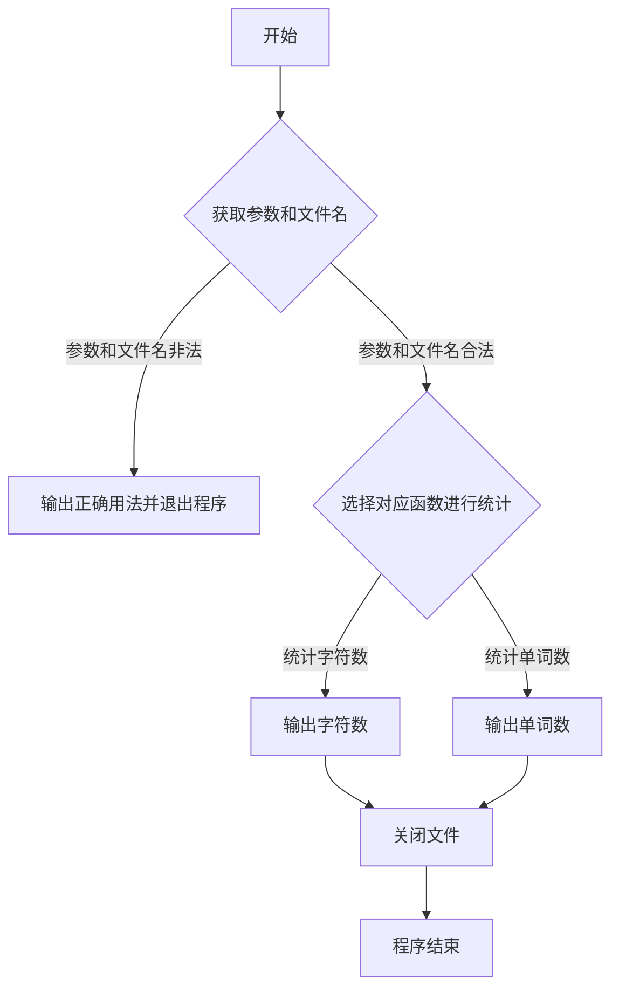

```mermaid
graph TD
	A[开始] --> B{获取参数和文件名};
	B -- 参数和文件名非法 --> E[输出正确用法并退出程序]
	B -- 参数和文件名合法 --> C{选择对应函数进行统计}
	C -- 统计字符数 --> D[输出字符数]
	C -- 统计单词数 --> F[输出单词数]
	D --> G[关闭文件]
	F --> G
	G --> H[程序结束]
```